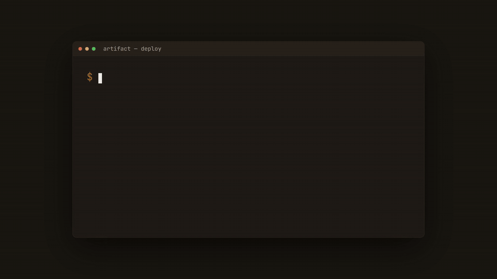

<div align="center">

# artifact.host

**Turn an HTML file into a live, shareable link — in seconds.**

No build step. No dependencies. Nothing for viewers to install.

[](https://github.com/ItaiTevet/artifact.host/actions/workflows/ci.yml)
[](LICENSE)
[](https://artifact.host)
[](#self-hosting)

<a href="https://artifact.host"></a>

_Deploy from the CLI → share the link → anyone views it live._ &nbsp;·&nbsp; [▶ Full-resolution video](marketing/artifact-cli.mp4)

[Live demo](https://artifact.host) · [CLI](cli/README.md) · [Self-hosting](#self-hosting)

</div>

---

## What is this?

Your AI assistant just generated an HTML dashboard, a chart, a one-pager. Now what? Screenshots
lose the interactivity; sending a file means the other person has to download and open it.

**artifact.host turns that HTML into a real URL.** Paste it in the browser or push it from the
CLI and you get a clean, live link — with a social preview card baked in, so it unfurls nicely the
moment you drop it in Slack, a PR, or a DM. Viewers just click. Nothing to install.

- **Hosted:** [artifact.host](https://artifact.host) — sign in and start sharing.
- **Self-hostable:** one container, embedded SQLite, local accounts — no external services required.

## Quick start

**From the command line** — point it at a file, get a URL:

```bash
npx artifact-host auth login            # sign in via the browser (one time)
npx artifact-host deploy ./index.html   # → https://artifact.host/a/8j3q4qv
```

`deploy` works without signing in, too — it returns a one-time edit token. Signing in claims
ownership instead. Point at your own instance with `--host https://artifacts.your-co.com` (or the
`ARTIFACT_HOST_URL` env var). See [`cli/README.md`](cli/README.md) for every command.

**From the browser** — paste or drop an `.html` file on the deploy panel at
[artifact.host](https://artifact.host) and copy the link.

## Features

- **Instant deploy** — HTML → live URL with no build and no dependencies, from the CLI or the browser.
- **Built to be shared** — clean `/a/<slug>` links and auto-generated Open Graph cards, so artifacts
  unfurl with a preview in Slack, social, and chat.
- **Visibility controls** — publish **public**, lock with a **password**, or keep it **restricted** to
  people you invite (each with a **View** or **Comment** role).
- **Comments & collaboration** — signed-in viewers drop comment **pins** and **text highlights**
  directly on the page; resolve, list, and reopen them. Readable by agents over the API/CLI.
- **Expiry built in** — set a TTL at deploy time (`--ttl 7d`); expired artifacts are pruned automatically.
- **Scriptable** — a REST API (`/api/deploy`, `/api/artifacts/*`) the CLI wraps, friendly to CI and agents.
- **Self-hostable** — a single container with SQLite and local accounts; pluggable auth and database
  for when you outgrow the defaults.

## Comments & collaboration

Owners enable comments per artifact via the **Allow comments** toggle (deploy panel or dashboard
editor). Signed-in viewers see comment **pins** rendered on the page — hover a pin to read it, or
click the **💬 pill** (bottom-right) to enter comment mode: click anywhere to drop a pin, or select
text to attach a highlight. Resolved comments are hidden in-page; list or reopen them via the API or CLI.

On public and password-protected artifacts, any signed-in viewer can post. On **restricted**
artifacts, each invited person gets a **View** or **Comment** role (set in the share editor).

For agents and scripts, `artifact comments` prints the thread:

```bash
npx artifact-host comments <slug>        # human-readable list
npx artifact-host comments <slug> --json # full structured records
```

## Self-hosting

The default profile needs **no external services**: a single container with an embedded SQLite
database and email/password accounts.

```bash
cp .env.example .env
# set AUTH_SECRET, COOKIE_SECRET, CRON_SECRET — e.g. openssl rand -hex 32
docker compose up -d
```

Open `http://localhost:3000`, create an account on `/dashboard`, then connect the CLI:

```bash
npx artifact-host auth login  --host http://localhost:3000
npx artifact-host deploy ./index.html --host http://localhost:3000
```

The SQLite database lives in the `artifact-data` volume. To prune expired artifacts, the bundled
`expirer` sidecar pings `/api/cron/expire` daily (or run it from a host cron).

### Authentication options

Pick a provider with `AUTH_PROVIDER`:

| Provider | Use case | Needs |
| --- | --- | --- |
| `local-password` *(default)* | Self-host, simplest | `AUTH_SECRET` |
| `oidc` | Company SSO — e.g. **Google Workspace**, Okta, Keycloak | OIDC client + `ALLOWED_EMAIL_DOMAINS` |
| `supabase` | The hosted cloud build | Supabase project |

**Company Google (Workspace).** Set `AUTH_PROVIDER=oidc`, `OIDC_ISSUER=https://accounts.google.com`,
your Google OAuth client id/secret, and `ALLOWED_EMAIL_DOMAINS=your-co.com` so only verified accounts
on your domain can sign in. The instance is only an OIDC *relying party* (Authorization Code + PKCE) —
it never runs its own OAuth server. Set the Google OAuth client's redirect URI to
`<APP_BASE_URL>/api/auth/oidc/callback`.

### Database options

| `DB_DRIVER` | Storage |
| --- | --- |
| `sqlite` *(default)* | Embedded file (`SQLITE_PATH`) — simplest, single container |
| `postgres` | Your own Postgres via `DATABASE_URL` — scale-up, multiple app instances |
| `supabase` | The hosted cloud build |

The schema is bootstrapped automatically on first run for `sqlite`/`postgres`. See
[`.env.example`](.env.example) for the full configuration surface.

## Development

```bash
npm install
npm run dev                    # http://localhost:3000
npm test                       # vitest unit/logic (no credentials needed)
npm run build && npm run e2e   # hermetic HTTP end-to-end (self-host mode)
```

Testing spans both deployment modes (cloud + self-host) — see [TESTING.md](TESTING.md).

The core service (`lib/artifacts/service.ts`) is persistence-agnostic behind `ArtifactRepository`;
`lib/db/factory.ts` selects the driver; auth is pluggable behind `AUTH_PROVIDER`. Programmatic deploys
use the REST API (`/api/deploy`, `/api/artifacts/*`), which the CLI wraps.

## License

MIT — see [LICENSE](LICENSE).
